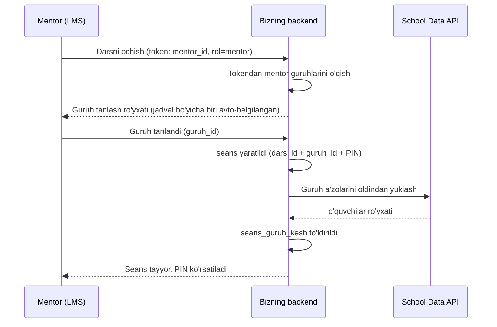
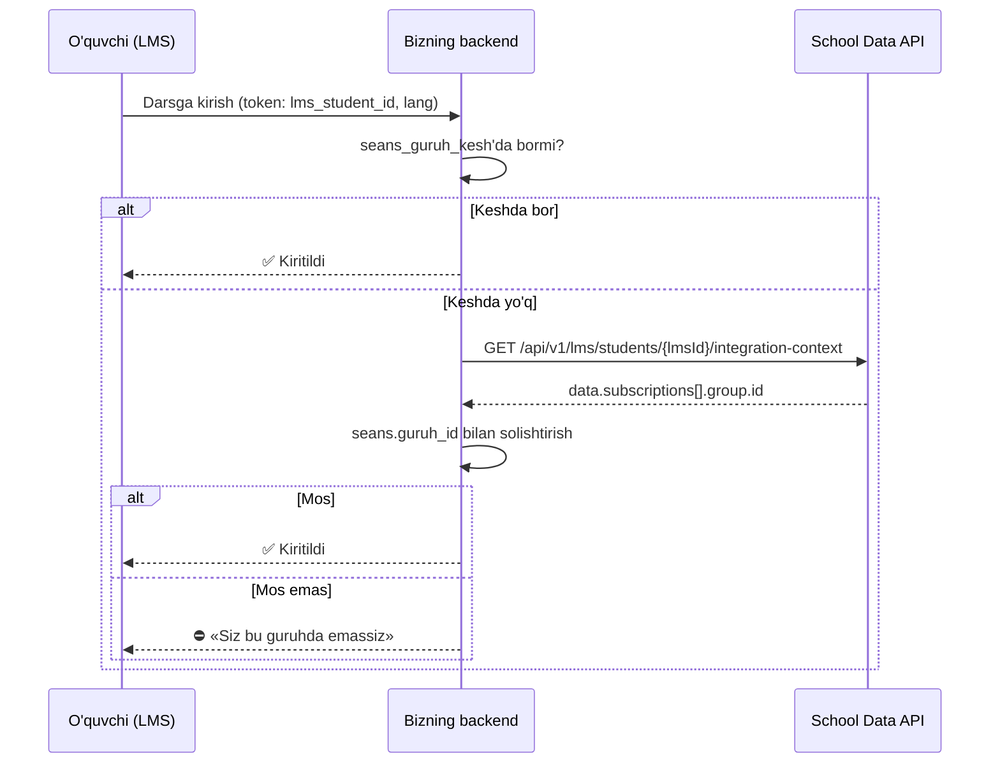

# Darsga kirish oqimi — mentor guruhi bo'yicha tekshiruv (MVP)

Holat: **loyiha taklifi**. Kod yozilmagan, hech qanday fayl o'zgartirilmagan.
Aloqador hujjatlar: `API_INTEGRATION.md` (School Data API v1), `LMS_INTEGRATSIYA_TZ.pdf`.

## 1. Maqsad

Mentor darsni ochadi → **faqat o'sha mentor tanlagan guruhdagi** o'quvchilar kira oladi.
Hozir kirish PIN bilan — kim PIN'ni bilsa, kiradi. Maqsad: PIN o'rniga (yoki ustiga)
**haqiqiy guruh-a'zoligi** tekshirilsin.

Qat'iy shart: **backend yiqilsa dars to'xtamaydi.** Tekshiruv qattiqlashadi, o'qish emas.

## 2. Uch tomon — kim nimani biladi

| Tomon | Biladi | Bilmaydi |
|---|---|---|
| **LMS** | kim kirdi (token), roli, ismi, tili (`lang`) | dars ichidagi ball, seans holati |
| **Bizning backend** | seans (dars + guruh + PIN), ball, arena | o'quvchi qaysi guruhda ekani |
| **School Data API** | o'quvchi → obuna → guruh → o'qituvchi | dars, seans, ball |

Ya'ni «o'quvchi shu guruhdami?» — **faqat School Data API** javob beradi.

## 3. 🔴 Hal qilinishi kerak bo'lgan bo'shliq

**School Data API mentorning guruhlari ro'yxatini bermaydi.**

Sabab: o'quvchi uchun ikki eshik bor (`/students/{crmId}/…` va `/lms/students/{lmsId}/…`),
**o'qituvchi uchun bunday eshik yo'q**. O'qituvchi faqat o'quvchi kontekstining ichida
ko'rinadi (`data.subscriptions[].group.teacher.id` — bu CRM `teacher_list.ID`).

Demak «LMS'ga kirgan bu mentor = CRM'dagi qaysi o'qituvchi?» savolini bu API yechmaydi.

**Yechim:** mentorning guruhlari **LMS tomonidan** berilsin (LMS'da bu ma'lumot bor).
Batafsil — 7-bo'lim.

## 4. Saqlanadigan ma'lumot (bizning backend)

Bitta jadval yetadi:

```
seans
  id
  dars_id          -- masalan 'pm-m1d2-v1'
  guruh_id         -- CRM group_list.ID — mentor tanlagan guruh
  mentor_id        -- LMS'dan kelgan mentor identifikatori
  pin              -- hozirgi PIN (zaxira sifatida qoladi)
  holat            -- ochiq | yopiq
  yaratilgan_vaqt
```

Guruh ro'yxatini keshlash uchun:

```
seans_guruh_kesh
  seans_id
  oquvchi_lms_id   -- guruhga tegishli o'quvchilar (seans ochilganda bir marta yoziladi)
  olingan_vaqt
```

## 5. Oqim A — mentor darsni ochadi



**Guruh tanlash oynasi** — mentorda ko'p guruh bo'lgani uchun majburiy:

```
Qaysi guruh bilan o'tasiz?
  ● F7-A   16:00, bugun        ← avto-belgilangan
  ○ F7-B   18:00, seshanba
  ○ M3-C   14:00, shanba
```

Avto-belgilash `group_list.days` («1,3,5») va `group_list.start_time` («16:00») bo'yicha —
hozirgi kun va vaqtga eng mos guruh. Mentor odatda tasdiqlaydi, bir bosish.

> Nega avtomatik emas: dars ko'chiriladi, mentor almashtiriladi, qo'shma dars bo'ladi.
> Bunda avtomatika adashadi — mentor adashmaydi. Tanlov qoladi.

## 6. Oqim B — o'quvchi kiradi



Tekshiruvning o'zagi — bitta shart:

```
seans.guruh_id ∈ javob.data.subscriptions[*].group.id
```

## 7. LMS dasturchisidan nima kerak

Token bilan birga quyidagilar kelishi kerak (kelishiladi):

- [ ] **rol** — `mentor` yoki `oquvchi`
- [ ] **o'quvchi uchun:** `lms_student_id` (bu `student_students.id`, ya'ni
      `/api/v1/lms/students/{id}/integration-context` uchun kalit)
- [ ] **mentor uchun:** guruhlari ro'yxati — `group_id` (CRM `group_list.ID`) + nomi + `days` + `start_time`
- [ ] **`lang`** — `uz` | `ru` (hozir ham keladi)
- [ ] ism — ekranda ko'rsatish uchun

🔴 Uchinchi band eng muhimi: usiz mentor guruh tanlay olmaydi (3-bo'limga qarang).

## 8. Xato holatlari — zaxira majburiy

| Holat | Qaror |
|---|---|
| API `200` qaytardi, guruh mos | ✅ Kiritiladi |
| API `200` qaytardi, guruh mos emas | ⛔ Kiritilmaydi |
| API `404` | ⚠️ **PIN bilan kiraveradi** — `404` sabab aytmaydi (yo'q ham, ruxsat yo'q ham bir xil) |
| API `429` | ⚠️ **PIN bilan kiraveradi**, `Retry-After` kutiladi |
| API `503` / tarmoq uzildi | ⚠️ **PIN bilan kiraveradi** |
| API `401` | ⚠️ **PIN bilan kiraveradi** + adminni ogohlantirish (token muammosi) |
| Token umuman yo'q | ⚠️ **PIN bilan kiraveradi** (hozirgi holat) |

**Qoida:** tekshiruv faqat *qo'shimcha qulf*. U ishlamasa — eski eshik ochiq qoladi.
Dars hech qachon backend sababli to'xtamaydi.

## 9. Bilib qo'yish kerak bo'lgan cheklovlar

- **Muzlatilgan obuna guruhda ko'rinmaydi.** API faqat `ACTIVE = 1` va
  `STATUS IN ('active','demo')` obunani qaytaradi. `freezed` / `archive` — chiqmaydi.
  To'lovi to'xtagan bola tekshiruvdan o'tmaydi → PIN zaxirasi shu yerda ham ishlaydi.
- **Bulk so'rov yo'q.** Har o'quvchi = bitta so'rov. Shuning uchun seans ochilganda
  guruh keshi oldindan to'ldiriladi (5-bo'lim) — dars boshida 25 bola birdan bosganda
  `429` ga urilmaslik uchun.
- **Bir o'quvchida bir necha LMS ID bo'lishi mumkin** (`lms_student_ids` massiv).
- **Snapshot kafolati yo'q** — kesh vaqtida guruh o'zgarishi mumkin. MVP uchun kesh
  umri: seans davomiyligi.
- **Token faqat serverda.** Frontendga, logga, query string'ga tushmasin.
- **`X-Request-ID`** javobda bo'lsa — logga yozilsin (audit uchun kerak bo'ladi).

## 10. MVP ga KIRMAYDI

- o'quvchini guruhga avtomatik qo'shish (API yozmaydi — faqat `GET`)
- jadval bo'yicha darsni avtomatik ochish
- guruh o'zgarishini real vaqtda kuzatish
- o'qituvchini CRM bilan avtomatik solishtirish (3-bo'limdagi bo'shliq)

---

## Keyingi qadam

1. LMS dasturchisi bilan 7-bo'limni kelishish (ayniqsa mentor guruhlari)
2. School Data API admini bilan kelishish: `student_students`, `subscribe_list`,
   `group_list` resurslariga va kerakli ustunlarga ruxsat + so'rov limiti
3. Sinov uchun: 1 mentor + 2 guruh + har guruhda 2 o'quvchi
